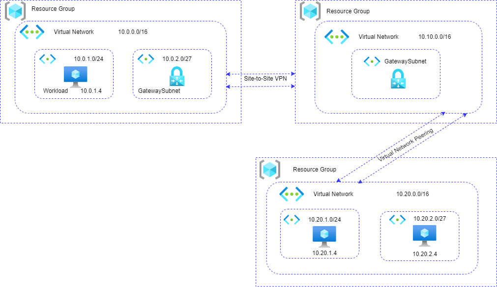

# Azure_VPN_Gateway

Azure VPN Gateway is a service that can be used to send encrypted traffic between an Azure virtual network and on-premises locations over the public Internet. You can also use VPN Gateway to send encrypted traffic between Azure virtual networks over the Microsoft network. VPN Gateway uses a specific type of Azure virtual network gateway called a VPN gateway. Multiple connections can be created to the same VPN gateway. When you create multiple connections, all VPN tunnels share the available gateway bandwidth.

## Why use VPN Gateway?

Here are some of the key scenarios for VPN Gateway:

Send encrypted traffic between an Azure virtual network and on-premises locations over the public Internet. You can do this by using the following types of connections:

##### Site-to-site connection: 
A cross-premises IPsec/IKE VPN tunnel connection between the VPN gateway and an on-premises VPN device.

##### Point-to-site connection: 
VPN over OpenVPN, IKEv2, or SSTP. This type of connection lets you connect to your virtual network from a remote location, such as from a conference or from home.

# Azure VPN Gateway Hybrid Network (Hub-Spoke + On-Prem)

This repository automates the provisioning of a hybrid network topology in Azure using Terraform, demonstrating both Site-to-Site (S2S) and Point-to-Site (P2S) VPN connectivity between an on-premises network and a Hub-and-Spoke architecture .

# Architecture Overview

### Network Topology

- On-Premises network with VM simulating a local environment.

- Hub VNet hosts the central VPN Gateway and connects to both On-Prem and Spoke.

- Spoke VNet connects to Hub via peering.

- VPN Gateways are deployed in both On-Prem and Hub.

- Site-to-Site VPN tunnel established between On-Prem and Hub.

- VNet Peering between Hub and Spoke enables full connectivity.

### VPN Connection Types
Site-to-Site (S2S): IPsec/IKE VPN tunnel between VPN gateways in On-Prem and Hub.

Point-to-Site (P2S): Optional connection for remote users via OpenVPN, SSTP, or IKEv2 (can be added later).

## Repository Structure
```

├── Images/                 # Architecture diagram, screenshots
├── VPN_GW/                 # Main Terraform configuration
├── modules/                # Reusable Terraform modules
│   ├── onprem/             # Simulated on-prem environment
│   ├── Hub/                # Hub network + VPN
│   ├── Spoke/              # Spoke network
│   ├── Gw/                 # VPN Gateway module
│   └── Peering/            # VNet peering logic
├── .gitignore
├── README.md
```


## Architecture Diagram :



## Deploying the Infrastructure
###### 1.Navigate to the deployment directory:
```
cd VPN_GW
```
###### 2.Initialize Terraform:
```
terraform init
```
###### 3.Review the execution plan:
```
terraform plan
```
###### 4.Apply the configuration:
```
terraform apply
```

## Resources Created
- 3 Resource Groups: onprem-rg, hub-rg, spoke-rg

- 3 VNets: onprem-vnet, hub-vnet, spoke-vnet

- 2 VPN Gateways: one in On-Prem and one in Hub

- 2 Local Network Gateways and VPN Connections (S2S)

- VNet Peering between Hub and Spoke

- Virtual Machines in On-Prem and Spoke networks

## Connectivity Flow
- On-Prem VM should be able to reach the Spoke VM via the Hub VPN Gateway.

- Hub acts as a central routing point between On-Prem and Spoke.

- You can optionally extend this to support Point-to-Site clients by adding user VPN configuration.

```
On-Prem VM 
   |
   | (onprem-gateway)
   |====================== IPsec/IKE VPN ======================|
   |                                                           |
Hub VNet <---------------------> Spoke VNet (via peering)      |
                        (hub-gateway)                          |
                                                            Spoke VM

```

## Connectivity Validation

- Ping or HTTP/RDP between:

- On-Prem VM ↔ Hub VM

- On-Prem VM ↔ Spoke VM (via hub and peering)